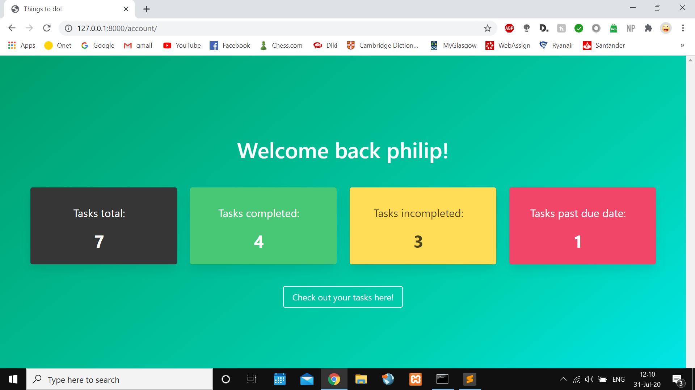

# thingstodo_website  

Aim of the application:  
A user is able to sign up and log in to their account where they can create, view and delete tasks they have to do.  
 
Technologies used:  
This application is based on the Django framework.  
HTML, CSS and Bulma were the front-end technologies used in this project.  

